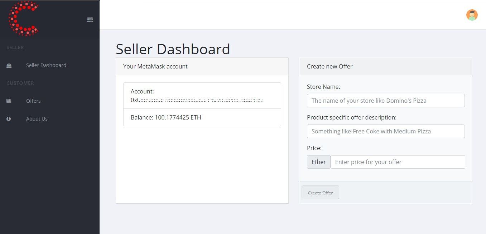

## What does this project do?

This is a DApp that allows store owners to post offers and customers to easily avail them.

  Users can
  * Add offers
  * Revoke their offers
  * Avail offers from other store owners


## Local development setup


1. Blockchain Setup:
Run the development blockchain. Keep Ganache running on this Terminal shell.
    ```javascript
    // Run Ganache locally on port 8545
      ganache-cli -p 8545
    ```
* Copy the first private key (0) generated by Ganache.
* Private key (0) account is set as the owner of the three hard-coded offers in the app.The remaining accounts will serve as General users.
    ```
    // Copy the first private key
    Private Keys
    ======================
    (0) Your First Private Key
    ```
* Open MetaMask on Chrome. Choose network Localhost 8545 and import account with private key copied from Ganache.

2. Get it running:
``` bash
# go into the project directory
 cd "Centareum-Offers-master"

# migrate the contracts to ganache
truffle migrate

# install all frontend dependencies (If you are on Windows you might see an error related to node.gyp,ignore and proceed to the next step.)
yarnpkg install

# serve a local front-end on http://localhost:8080
yarn run dev
```

* Now you can direct your browser to http://localhost:8080 and you will see this page:


